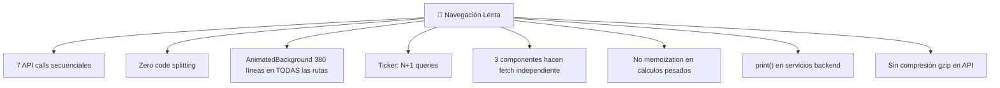

# 🔴 CostBench — Auditoría de Rendimiento y Calidad

## Diagnóstico: Los 8 Culpables del Lag



---

## Foco 1: Frontend — Optimización Extrema

### 🔴 BUG #1: Waterfall de 7 API calls secuenciales

El **culpable principal del lag**. Cada `await` bloquea al siguiente:

```diff
- // ANTES: ~3.5s total (500ms × 7 calls en serie)
- const cpiRes = await axios.get('/api/v1/market/history?series_id=CPIAUCSL');
- const yieldsRes = await axios.get('/api/v1/market/history?series_id=DGS10');
- const goldRes = await axios.get('/api/v1/market/history?series_id=GOLDAMGBD228NLBM');
- const copperRes = await axios.get('/api/v1/market/history?series_id=PCOPPUSDM');
- const oilRes = await axios.get('/api/v1/market/history?series_id=DCOILWTICO');
- const btcRes = await axios.get('/api/v1/market/history?series_id=BTC-CLP');
- const ethRes = await axios.get('/api/v1/market/history?series_id=ETH-CLP');

+ // DESPUÉS: ~500ms total (todas en paralelo)
+ const [rankingRes, cpiRes, yieldsRes, goldRes, copperRes, oilRes, btcRes, ethRes] =
+   await Promise.all([
+     axios.get(`/api/v1/atc/ranking?limit=${limit}&currency=${currency}`),
+     axios.get('/api/v1/market/history?series_id=CPIAUCSL'),
+     axios.get('/api/v1/market/history?series_id=DGS10'),
+     axios.get('/api/v1/market/history?series_id=GOLDAMGBD228NLBM'),
+     axios.get('/api/v1/market/history?series_id=PCOPPUSDM'),
+     axios.get('/api/v1/market/history?series_id=DCOILWTICO'),
+     axios.get('/api/v1/market/history?series_id=BTC-CLP'),
+     axios.get('/api/v1/market/history?series_id=ETH-CLP'),
+   ]);
```

**Impacto: ~7x más rápido** en la carga inicial.

---

### 🔴 BUG #2: Zero Code Splitting

Todos los componentes se importan eagerly. Al visitar `/login`, el browser descarga y parsea **ChartCarousel** (13KB), **ModelComparison** (25KB), **MarketDashboard** (21KB), **AnimatedBackground** (15KB) — todo innecesario para la página de login.

```diff
- // ANTES: Importaciones directas (todo en un solo bundle)
- import ChartCarousel from './components/ChartCarousel';
- import ModelComparison from './components/ModelComparison';
- import MarketDashboard from './components/Dashboard/MarketDashboard';
- import SclodaChat from './components/SclodaChat';
- import AnimatedBackground from './components/AnimatedBackground';

+ // DESPUÉS: Lazy loading con Suspense
+ const ChartCarousel   = React.lazy(() => import('./components/ChartCarousel'));
+ const ModelComparison = React.lazy(() => import('./components/ModelComparison'));
+ const MarketDashboard = React.lazy(() => import('./components/Dashboard/MarketDashboard'));
+ const SclodaChat      = React.lazy(() => import('./components/SclodaChat'));
+ const AnimatedBackground = React.lazy(() => import('./components/AnimatedBackground'));

+ // Wrapper de Suspense en el dashboard
+ const DashboardFallback = () => (
+   <div className="d-flex justify-content-center py-5">
+     <div className="spinner-border text-success" />
+   </div>
+ );

+ // En el JSX del dashboard:
+ <React.Suspense fallback={<DashboardFallback />}>
+   <AnimatedBackground />
+   <Ticker />
+   <ChartCarousel macro={macro} />
+   ...
+ </React.Suspense>
```

**Impacto:** Login se carga **~60% más rápido**, el dashboard carga componentes bajo demanda.

---

### 🔴 BUG #3: Ticker — Patrón N+1 de API

[Ticker.jsx](file:///Users/Matt/Documents/Personal/Carlemany/Titulo/frontend/src/components/Ticker.jsx) fetcha `/market/indices`, luego hace **una request por cada índice** individualmente:

```diff
- // ANTES: N+1 — fetcha 10 índices = 11 requests HTTP
- const indicesRes = await axios.get('/api/v1/market/indices');
- const indices = indicesRes.data.items || [];
- const fetchedItems = await Promise.all(indices.map(async (item) => {
-     const hRes = await axios.get(`/api/v1/market/history?series_id=${item.series_id}`);
-     // ...
- }));

+ // DESPUÉS: Un solo endpoint batch
+ const res = await axios.get('/api/v1/market/latest');
+ // Backend devuelve: { items: [{series_id, label, latest_value, change_pct}] }
+ setItems(res.data.items);
```

> [!IMPORTANT]
> Se necesita crear un endpoint batch `GET /api/v1/market/latest` en el backend que devuelva el último valor de todos los índices en una sola query.

---

### 🟡 BUG #4: AnimatedBackground en TODAS las rutas

**380 líneas de SVGs + 40 motion particles + 30 candlesticks + 6 chart lines** → todo usando `framer-motion` con animaciones infinitas.

Se renderiza en **Login**, **Onboarding**, y **Dashboard** (3 instancias simultáneas potenciales).

```diff
- // ANTES: Se carga siempre, 40 partículas con animación infinita
- {Array.from({ length: 40 }, (_, i) => (
-     <motion.div key={i} animate={{ y: [...], opacity: [...] }}

+ // DESPUÉS: Reducir partículas, usar CSS animations en vez de JS
+ // Y renderizar SOLO en el dashboard, no en auth pages
+ {Array.from({ length: 15 }, (_, i) => (
+     <div key={i} className="particle" style={{
+         '--delay': `${i * 0.8}s`,
+         '--x': `${Math.random() * 100}%`
+     }} />
```

> [!TIP]
> Mover las animaciones de `framer-motion` a CSS `@keyframes`. Las animaciones CSS se ejecutan en el compositor del GPU, no en el hilo principal de JS.

---

### 🟡 BUG #5: No hay memoización en componentes pesados

[ChartCarousel.jsx](file:///Users/Matt/Documents/Personal/Carlemany/Titulo/frontend/src/components/ChartCarousel.jsx), [ModelComparison.jsx](file:///Users/Matt/Documents/Personal/Carlemany/Titulo/frontend/src/components/ModelComparison.jsx), y [MarketDashboard.jsx](file:///Users/Matt/Documents/Personal/Carlemany/Titulo/frontend/src/components/Dashboard/MarketDashboard.jsx) se re-renderizan cada vez que `App.jsx` cambia estado:

```diff
- // ANTES: Se re-renderiza con cualquier cambio de estado en App
- export default ModelComparison;
- export default ChartCarousel;
- export default MarketDashboard;

+ // DESPUÉS: Prevenir re-renders innecesarios
+ export default React.memo(ModelComparison);
+ export default React.memo(ChartCarousel);
+ export default React.memo(MarketDashboard);
```

Y en App.jsx, memoizar el callback:

```diff
- const handleUpdate = () => { fetchData(); };
+ const handleUpdate = useCallback(() => { fetchData(); }, [limit, currency]);
```

---

### 🟡 BUG #6: Fetch independiente en 3 componentes

El dashboard dispara API calls desde 4 lugares **simultáneamente**:

| Componente | Fetches | En mount? |
|---|---|---|
| `App.fetchData()` | 8 calls (ranking + 7 market) | ✅ |
| `Ticker.fetchMarketData()` | 1 + N calls (N+1) | ✅ |
| `ModelComparison.fetchData()` | 1 call (`/api/v1/models`) | ✅ |
| `ChartCarousel.fetchInsights()` | 7 calls (Scloda insights per chart) | ✅ |
| `MarketDashboard.fetchInsights()` | Multiple Scloda calls | ✅ |

**Total al abrir dashboard: ~25+ HTTP requests simultáneas.** 

> [!CAUTION]
> Consolidar en un solo `useDashboardData` hook que haga fetch una vez y distribuya via Context, o usar React Query con cache compartido.

---

## Foco 2: Backend — Limpieza de Código

### 🔴 print() → logging (Tolerancia Cero)

**Archivos con `print()` en producción** (servicios que corren en Docker):

| Archivo | Líneas | Fix |
|---|---|---|
| [bls.py](file:///Users/Matt/Documents/Personal/Carlemany/Titulo/app/services/bls.py) | 58, 62 | `logger.error()` / `logger.warning()` |
| [treasury.py](file:///Users/Matt/Documents/Personal/Carlemany/Titulo/app/services/treasury.py) | 47, 49 | `logger.error()` / `logger.warning()` |

```diff
- # bls.py L57-62
- except Exception as e:
-     print(f"Failed to fetch BLS: {e}")
-     print("Returning MOCK BLS data.")

+ import logging
+ logger = logging.getLogger(__name__)
+
+ except Exception as e:
+     logger.error("bls_fetch_failed", exc_info=True)
+     logger.warning("bls_falling_back_to_mock")
```

```diff
- # treasury.py L46-49
- except Exception as e:
-     print(f"Failed to fetch Treasury: {e}")
-     print("Returning MOCK Treasury data")

+ logger.error("treasury_fetch_failed", exc_info=True)
+ logger.warning("treasury_falling_back_to_mock")
```

> [!NOTE]
> Los `scripts/` (`run_pipeline.py`, `inspect_data.py`, etc.) usan `print()` 63+ veces — esto es **aceptable** en scripts CLI. No requiere refactorización.

---

### 🟡 Sin compresión gzip en respuestas API

Los payloads JSON (especialmente `/market/history` con series largas) se envían sin comprimir.

```python
# DESPUÉS: Agregar en app/__init__.py
from flask_compress import Compress

def create_app():
    app = Flask(__name__)
    Compress(app)  # Gzip automático para responses > 500 bytes
    # ...
```

---

## Resumen de Prioridades

| # | Fix | Impacto | Esfuerzo |
|---|---|---|---|
| 1 | `Promise.all` en `fetchData` | 🔴 Crítico — elimina waterfall de 3.5s | 5 min |
| 2 | `React.lazy` + `Suspense` | 🔴 Alto — reduce bundle inicial ~60% | 15 min |
| 3 | `React.memo` en componentes pesados | 🟡 Medio — previene re-renders | 5 min |
| 4 | Endpoint batch `/market/latest` para Ticker | 🟡 Medio — elimina N+1 frontend | 30 min |
| 5 | `print()` → `logging` en services | 🔴 Obligatorio — calidad de código | 5 min |
| 6 | `flask-compress` (gzip) | 🟡 Medio — reduce transferencia ~70% | 5 min |
| 7 | Reducir AnimatedBackground particles | 🟡 Medio — reduce carga GPU/JS | 10 min |
| 8 | Consolidar fetches en hook/context | 🟢 Bajo prioridad — arquitectura limpia | 1-2 hrs |
